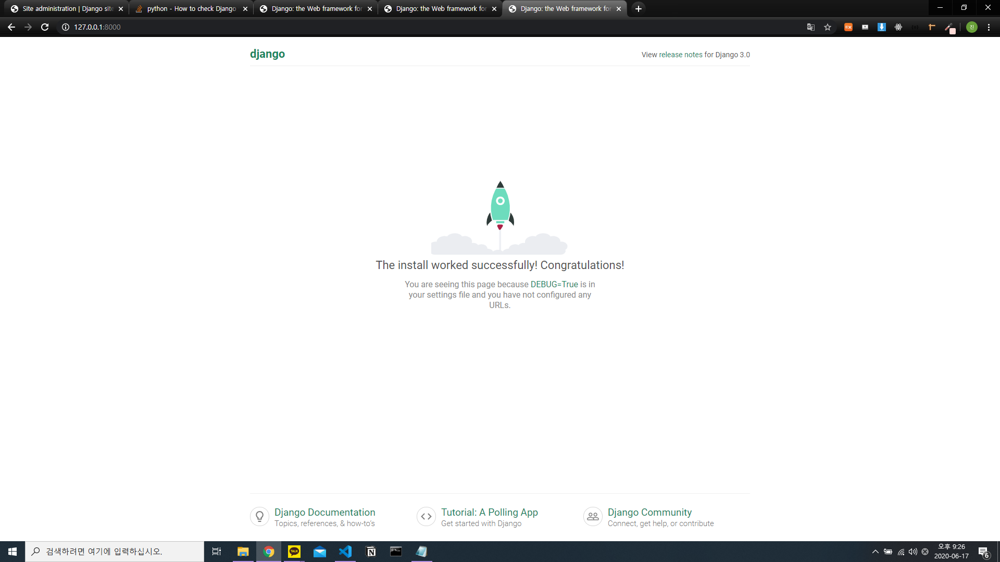
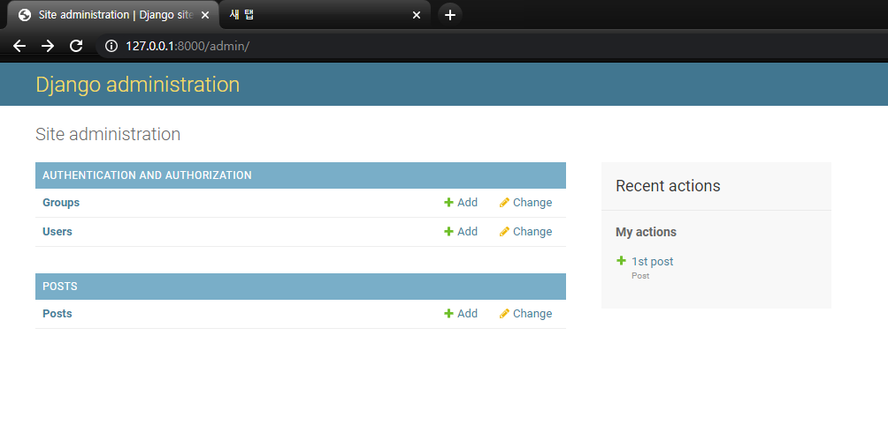
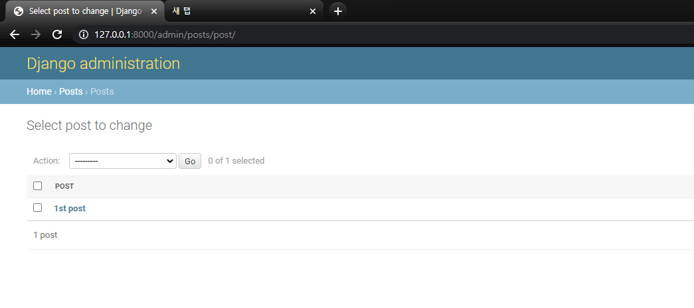
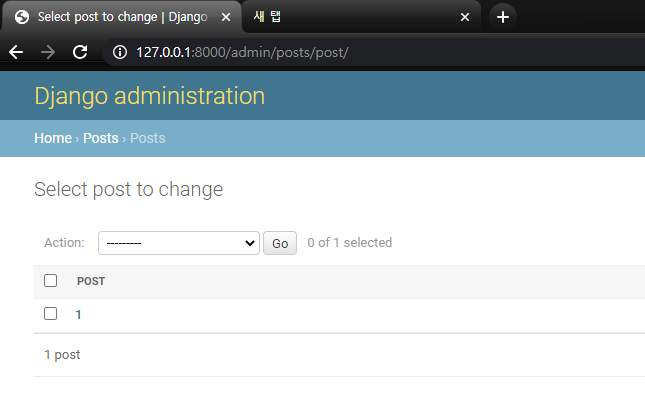
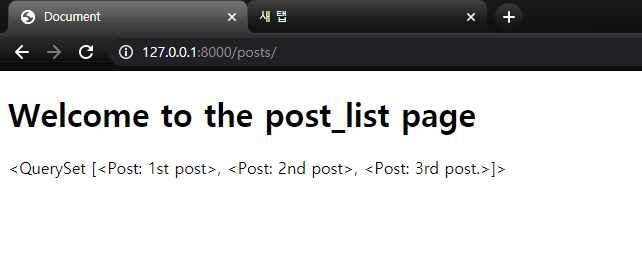
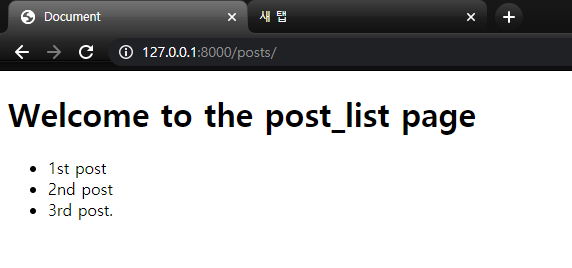

# django crash course for beginners

## 1. environment settings

### (1) versions

> versions

| django | python |
| :----: | :----: |
| 3.0.3  | 3.7.6  |

> the way to get django version

```python
import django
django.get_version
```

### (2) start django project

At the terminal(I did this in vs code terminal)
at directiry django

```cmd
django-admin startproject tutorial
```

and this makes django\tutorial and all that.

tutorial\tutorial\ is basically a root directory which includes

-   settings.py
-   urls.py
-   wsgi.py

wsgi.py has codes about how to run my server.

Also, rename the upper `tutorial` directory to `src`

### (3) make database(sqlite)

Type the following at vs code terminal

```cmd
python manage.py migarate
```

and you will see db.sqlite3 right under the src directory.

### (4) start django server

Type the following at vs code terminal

```cmd
python manage.py runserver
```

> Also, I moved the directory src just to organize my django projects nicely. I moved this src directory just under crash1hr folder and I checked if the server run is okay, and it turned out to be okay.

### (5) look around inside of tutorial directory

-   settings.py
    This should be included in .gitignore, because of the secret key and the debug thing. Also, the debug True should be False when we actually host on the server.

### (6) start an app

```cmd
python manage.py startapp posts
```

This will make src\posts and all that.

### ending the setups

Django helps you to make your project easier.

## 2. Starting to make an app

Before writing all these codes, you need to edit INSTALLED_APPS in src\tutorial\settings.py.

```python
INSTALLED_APPS = [
    # 아래는 편의상 생략함
    '...',
    # following line is the one you should add
    'posts',
]

```

이걸로 django가 앱을 실행할 때 post를 look할 수 있다.

### (1) Post model 생성하기

models.py에서 아래와 같이 적어준다.

```python
from django.db import models


# following is the codes you need to add
class Post(models.Model):
    title = models.CharField(max_length=50)

    def __str__(self):
        return self.title

```

이후 cmd 창에서 src 디렉토리 아래서

```cmd
python manage.py makemigrations
```

이렇게 적어두면

```
Migrations for 'posts':
  posts\migrations\0001_initial.py
    - Create model Post
```

posts\migrations\0001_initial.py가 생기는데, 이는 django에게 migration을 할 준비가 되었다는 의미라고 한다.

따라서 다음 코드로 database에 Post를 넣는다.

```cmd
python manage.py migrate
```

### (2) Super User 계정 만들어주기

super user는 모든 게시물들을 관리하는 메니저로, db에 오고가는 정보들을 확인할 수 있다.

```cmd
python manage.py createsuperuser
python manage.py runserver
```

이후 development server 옆에 써져 있는 ip 주소를 chrome창에 치면 아래와 같은 화면이 나오는데, ip주소\admin 이렇게 치면 아까 createsuperuser로 기입한 아이디와 비번으로 로그인할 수 있다.



### (3) Home에 Posts 만들어주기

models.py에 class Post를 만들어주었다고 해도, 아직 관리 사이트에는 Posts가 존재하지 않는다.

따라서, admin.py에 다음과 같은 내용을 추가해준다.

```python
# admin.py
from django.contrib import admin

# 아래가 추가할 내용
from .models import Post
admin.site.register(Post)
```

그리고 save해 주면 아래와 같이 Posts를 관리할 수 있는 섹션(?)이 만들어진다.



여기서 models.py에 적었던 title을 적을 수 있는데, `__str__` 메소드에 return self.title을 했어서 다음과 같이 나타난다.



`__str__` 메소드를 만약 다음과 같이 쓴다면

```python
def __str__(self):
    return "{}".format(self.id)
```



### (4) shell로 post 객체 추가해주기

```cmd
python manage.py shell
```

을 하면 python interpreter처럼 됨. 중요한 건 여기서 Post를 새로 추가를 할 수 있다는 것이다.

아래는 사용방법이다.

```python
from posts.models import Post
Post.objects.all()
# <QuerySet [<Post: 1st post>]>
Post.objects.all().first()
# <Post: 1st post>
Post.objects.all().last()
# <Post: 1st post>
```

```python
p = Post.objects.create(title='2nd post')
p
# <Post: 2nd post>
```

```python
p = Post()
p.title = '3rd post'
p.save()
p
# <Post: 3rd post>
Post.objects.all()
# <QuerySet [<Post: 1st post>, <Post: 2nd post>, <Post: 3rd post>]>

p.title='3rd post.'
p.save()
p
# <Post: 3rd post.>
Post.objects.all()
# <QuerySet [<Post: 1st post>, <Post: 2nd post>, <Post: 3rd post.>]>
```

### (5) url 추가해주기

src/posts/views.py에서 아래와 같이 적어주고,

```python
from django.shortcuts import render

def list_posts(request):
    # 이 메소드가 추가한 코드
    return render(request, "post_list.html", {})
```

src/tutorial/urls.py에서 아래와 같이 적어준다.

```python
from django.contrib import admin
from django.urls import path

# 아래가 추가한 코드 1
from posts.views import list_posts

urlpatterns = [
    path('admin/', admin.site.urls),
    # 아래가 추가한 코드 2
    path('posts/', list_posts)
]

```

여기서 추가한 코드 1에서 `from posts.views`은 posts directory 자체가 모듈과 같이 작동하기 때문에 이렇게 쓸 수 있는 것 같다(posts directory 아래에 `__init__.py`).

본론으로 돌아가서, 그러면 사용자(클라이언트)에게서 posts/라는 request(get)가 들어오면 src/tutorial/urls.py에서 posts/를 찾아서 views.py에 있는 list_posts를 실행한다(?).
즉, post_list.html을 화면에 render하는 걸 return 해 준다.

### (6) render해주는 html 문서 만들어주기

post_list.html을 만들어주자.
src/posts/templates/posts/post_list.html 이 경로로 html 문서를 만든 후
views.py를 수정해 준다. templates를 굳이 한 이유는 django가 이렇게 app 안에 templates 폴더 "안의" html문서를 호출하게 하기 때문.

```python
from django.shortcuts import render

def list_posts(request):
    # 이 메소드가 추가한 코드
    return render(request, "posts/post_list.html", {})
```

### (7) views.py에서 context

src/posts/views.py에서

```py
    return render(request, "post_list.html", {})
```

부분에 세번째 인자가 context인데, context는 말 그대로 내용이다. 즉, post_list.html에 넘겨줄 내용을 말한다. 이를 우리가 shell로 기입해 둔 Post.objects로 내용을 넘겨 보자.

```py
from django.shortcuts import render
from .models import Post

def list_posts(request):
    # 아래 4줄이 새로 추가한 코드
    posts = Post.objects.all()
    context = {
        'post_list': posts
    }
    # 아래 1줄이 edit을 한 코드
    return render(request, "posts/post_list.html", context)
```

> 이때 Post.objects.all()에서 objects의 s를 빼먹으면 오류가 생긴다.

post_list.html의 내용은 다음과 같이 `{{post_list}}`로 기입한다.

```html
<!DOCTYPE html>
<html lang="en">
    <head>
        <meta charset="UTF-8" />
        <meta name="viewport" content="width=device-width, initial-scale=1.0" />
        <title>Document</title>
    </head>
    <body>
        <h1>Welcome to the post_list page</h1>
        <!-- 아래가 추가된 코드 -->
        {{ post_list }}
    </body>
</html>
```

그러면 아래와 같이 화면이 구성된다.


조금 더 가독성이 좋게 화면을 구성하기 위해서, ``을 이용하여 html을 작성할 수 있다.

```html
<!-- 앞부분 생략 -->
    <body>
        <h1>Welcome to the post_list page</h1>
        <ul>
            <!-- 아래 세줄이 추가,수정된 코드 -->
            
            <li>{{ post }}</li>
            
        </ul>
    </body>
</html>
```

결과화면:



### (8) urls.py에서 include 함수 이용하기

src/tutorial/urls.py에서 urlpatterns에 path를 추가해주기 위해 아래와 같이 매번 from ~ import ~를 해주는 게 번거롭다면

```py
from django.contrib import admin
from django.urls import path, include

# 아래가 추가한 코드 1
from posts.views import list_posts

urlpatterns = [
    path('admin/', admin.site.urls),
    # 아래가 추가한 코드 2
    path('posts/', list_posts)
]
```

include 함수를 이용하면 된다.

```py
from django.contrib import admin
# 아래가 수정한 코드1
from django.urls import path, include

urlpatterns = [
    path('admin/', admin.site.urls),
    # 아래가 수정한 코드2
    path('posts/', include('posts.urls'))
]
```

include 함수는 path 안의 첫번째 인자(posts/) 뒤에 오는 무엇이던 posts/urls.py로 보내서 처리하게 하는 기능을 한다.
그래서 src/posts/urls.py 에 다음과 같은 코드를 작성한다.

```py
from django.urls import path

from .views import list_posts

urlpatterns = [
    path('', list_posts)    # A줄
]
```

이때 주의할 점은 A줄에서 `path('lists/', list_posts)`라고 적으면 chrome에서 http://127.0.0.1:8000/posts/ 는 에러가 나오고, http://127.0.0.1:8000/posts/lists 는 아까 이 화면이 나온다는 것이다.


## 3. Practicing done, lets make actual app!

install virtual env
=> what should I do with anaconda?
maybe find some informations from anaconda docs...
